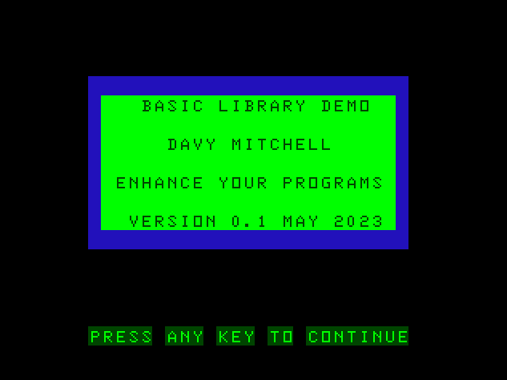

# Name
Basic Library

# Type
Utility

# Source
I started to put this together just to have a standard title screen for the type-in videos. It has grown from there to have various routines.

There's a few more I want to add but I wanted to get an initial version of this out in the wild first.

Please send feedback!

# Notes
1. Feel free to use this but it may change a good deal such as variable names and line numbers. Should stabalise in a version or two.
2. It is not optimised for speed as they are general purpose routines.
3. The MC-10 version only differs by NOT using the STRING$ command.
4. All REMs can be removed but watch your GOSUB.

# Video
https://youtu.be/l-FnpnxN67c

# GitHub
https://github.com/daftspaniel/RetroCornerRedux/Common/BasicLib