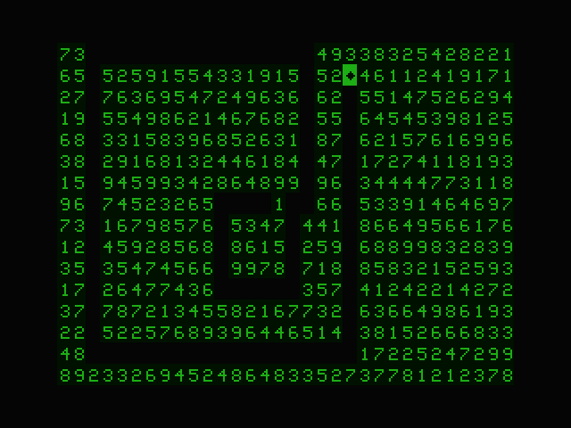

# Name
Glutton

# Type
Puzzle Game

# Controls
Q / A = UP AND DOWN
O / P = LEFT AND RIGHT
X = FINISH ROUND

Moving onto a numbered square moves you n steps in that direction. You must stay on the board and cannot step on a square twice. Keep playing until you cannot make a move.

Davy Mitchell
August 2025

# GitHub
https://github.com/daftspaniel/RetroCornerRedux/tree/main/Dragon/Originals/Glutton