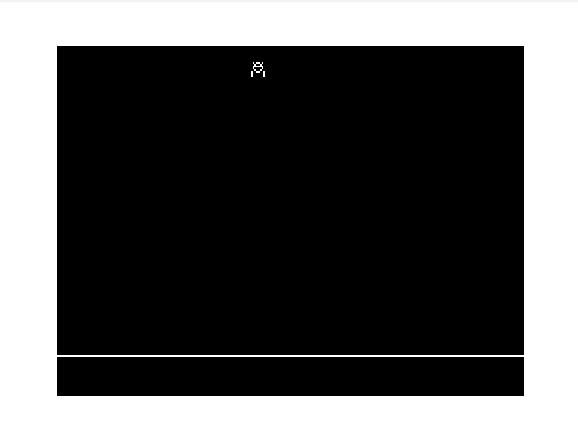

# Name
Lunar Lander

# Type
GFX Demo

# Source
Book: 35 Programs For the Dragon 32 by Dr Tim Langdell

# Notes
Argh the flickering! Use Q and A to control thrust.

# GitHub
https://github.com/daftspaniel/RetroCornerRedux