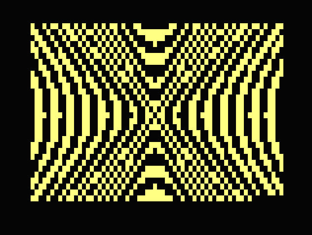

# Name
Moire / SQR Patterns

# Type
Graphics

# Description

This produces a series of patterns on the low res screen. There's quite a slow precalculation before the drawing begins but it's worth the wait.

# Source

Based on a C64 one liner from this Facebook post
https://www.facebook.com/groups/2057165187928233/permalink/3651259908518745

Original by Josip Kalebić,

# Video

# GitHub

https://github.com/daftspaniel/RetroCornerRedux
