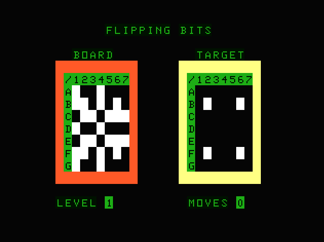

# Name
Flipping Bits

# Type
Game Puzzle

# Source
Coded from scratch based on the game details at:
https://rosettacode.org/wiki/Flipping_bits_game

Davy Mitchell August 2023
MC-10 Port 2024

# Controls

Press 1-7 A-G to flip a column or row.

Press R to reset to the starting point.

# GitHub
https://github.com/daftspaniel/RetroCornerRedux/tree/main/Dragon/Originals/FlipBits
