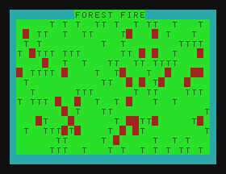

# Name
Forest Fire

# Type
GFX Demo

# Source
This is my own implementation of the 'Forest Fire' cellular automata.
I have not yet seen this on the Dragon/Coco/MC-10 family. Is this a first? :-)
Could probably do with being compiled!

For more info:
https://en.wikipedia.org/wiki/Forest-fire_model

https://rosettacode.org/wiki/Forest_fire

# Updates
+ Changed display to be character updated at a time.
+ Removed name from display screen
+ Added info to Please Wait screen
+ Created compiled C10 version

# Video
Version 0.1
https://youtu.be/BAMv_OHlbLA
Version 0.1

# GitHub
https://github.com/daftspaniel/RetroCornerRedux